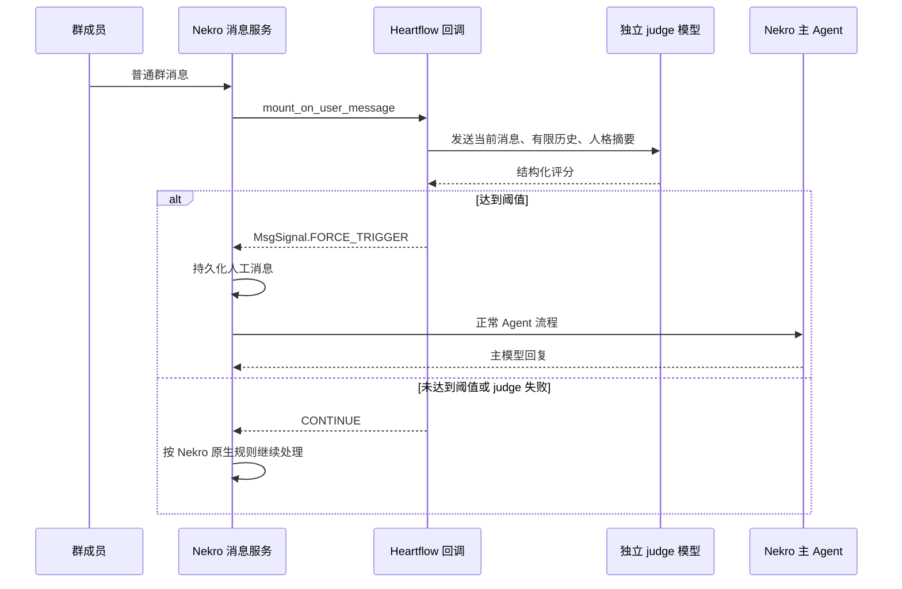

# AstrBot Heartflow 到 NekroAgent 的迁移设计

本文记录第一阶段只读调研后的实现约定。目标是保留 Heartflow 的核心体验，同时接受 NekroAgent 现有插件 API 的差异。

当前分支已完成 `0.1.0` 的第一版实现：独立 HTTP judge、群消息回调、`FORCE_TRIGGER`、`DBChatMessage` 历史适配、内存状态、运行时提示注入和管理命令均已落地。本文继续记录尚未通过真实 Nekro 环境确认的边界。

## 1. 调研基线

- AstrBot 上游：[`Astrbot_plugin_Heartflow`](https://github.com/advent259141/Astrbot_plugin_Heartflow)，调研提交为 `78eb5320ee04fd6fcdd9c4e4e99c9cb29b7e74fc`。
- NekroAgent API：`NekroPlugin`、`mount_on_user_message`、`mount_prompt_inject_method`、`MsgSignal.FORCE_TRIGGER`、插件命令和插件存储。
- 目标仓库在本设计提交前为空，因此没有现有 Nekro Heartflow 实现可以兼容。
- 独立模型调用参考 workdir 中的 `nekro_plugin_media`：配置 API Key/模型，在独立客户端中直接请求模型，再把结果交给主流程。

## 2. AstrBot 原回调到底做什么

AstrBot 的群消息回调不是直接生成回复，也不是一个独立的聊天机器人。它的职责是把“普通群消息”变成“主模型可以主动参与的一次正常 Agent 请求”。

原流程可以概括为：

1. 接收普通群消息，过滤机器人、空消息、命令、白名单外会话和直接 @/唤醒消息。
2. 在每个聊天会话的锁内读取能量、冷却时间、最近上下文和人格信息。
3. 调用独立的小模型输出结构化判断，计算是否达到回复阈值。
4. 判断通过后只设置触发标记和预留状态，不在回调中发送文本。
5. AstrBot 主框架随后照常调用大模型生成最终回复。
6. 大模型成功后提交能量衰减、回复次数和机器人消息记录；失败时回滚预留状态。

因此，迁移到 NekroAgent 时，最接近的实现是：

```text
mount_on_user_message(ctx, message)
    -> 普通群消息过滤和 judge
    -> 判断通过：返回 MsgSignal.FORCE_TRIGGER
    -> NekroAgent 持久化消息并运行正常 Agent
```

回调本身不应该调用 `send_text` 发送一条“主动回复”，否则会绕过频道当前人格、历史、配额和主模型流程。

## 3. 独立 judge 模型调用

### 3.1 参考 `nekro_plugin_media`

workdir 中的媒体插件采用了清晰的独立客户端模式：

- `__init__.py` 通过配置类声明 API Key 和模型；
- `gemini.py` 创建专用客户端，使用 `aiohttp` 直接请求外部模型接口；
- `parser.py` 构造提示词并调用客户端；
- 解析结果返回给上层流程，不修改 Nekro 主模型配置。

Heartflow 可以复用这个结构，建议拆成：

```text
__init__.py       插件实例、配置、回调注册
judge_client.py   独立 HTTP 模型客户端
judge.py          JSON 解析、重试、评分和超时
history.py        DBChatMessage 查询与上下文清洗
state.py          能量、冷却、会话锁和有界缓存
commands.py       status/reset/cache 命令
```

### 3.2 建议配置

建议将 AstrBot 的 `judge_provider_name` 改成独立 HTTP 模型配置：

| 配置项 | 作用 |
| --- | --- |
| `judge_api_base_url` | judge 服务地址，支持 OpenAI-compatible `/v1/chat/completions` 或项目约定的 JSON 接口 |
| `judge_api_key` | 独立模型密钥，标记为 secret，不写入日志 |
| `judge_model` | judge 模型名称 |
| `judge_timeout_seconds` | 单次请求超时和总 deadline |
| `judge_max_retries` | JSON 解析失败时的有限重试次数 |
| `judge_include_reasoning` | 是否保留简短判断理由 |

请求只在消息回调中发起，不在模块导入时联网。网络错误、超时、HTTP 错误和非法 JSON 都应该安全地返回“不触发”，并记录脱敏后的 warning。

judge 的输出仍保持 AstrBot 的结构化思路：五项 0 到 10 的分数、总体分数和 `should_reply`。所有群消息、人格和历史都必须在 judge 提示词中标记为不可信数据，避免把聊天内容当成控制指令。

## 4. Prompt 注入的兼容取舍

AstrBot 的 `on_llm_request` 会在主模型请求前修改 system prompt。NekroAgent 的公共插件 API 没有同样的请求对象回调，但 `mount_prompt_inject_method` 可以提供短的运行时上下文。

本项目接受这种不精确兼容：

```text
本轮由 Heartflow 根据群聊上下文主动参与，请自然地加入当前话题，不要解释触发机制。
```

这段文字只作为运行时上下文提供给主 Agent，不要求它出现在真实 system prompt 中。注入内容应保持很短，失败时返回空字符串，不应阻塞主模型。

## 5. 使用 DBChatMessage 读取上下文

NekroAgent 核心历史模板、记忆服务、频道路由和内置插件已经使用 `DBChatMessage`。因此 Heartflow 可以在 `history.py` 中按 `chat_key` 查询最近消息，用于 judge 上下文和最近机器人回复判断。

约定如下：

- 所有查询都必须有明确的数量上限，例如 `judge_context_count`；
- 按发送时间或主键倒序读取，再恢复为正序上下文；
- 同时保留人工消息和机器人消息，用 sender 信息区分角色；
- 当前插件回调发生在本条人工消息持久化前，因此当前消息应直接使用 `ChatMessage` 参数加入 judge payload，不能只依赖数据库查询；
- 查询和格式化放在单独适配层，避免业务代码散落内部 ORM 调用；
- 对数据库异常采取安全降级：保留当前消息，缺少历史时仍可进行 judge；
- 控制文本长度，避免把完整历史或敏感字段发送给外部 judge 服务。

`DBChatMessage` 是当前 Nekro 工作区中实际使用的内部模型，不再把它视为迁移阻塞项；但后续仍可把这层替换为正式的公共历史 API。

## 6. 消息与主动触发流程



直接 @、唤醒词和命令不应再经过 Heartflow judge：它们由 Nekro 的显式触发或命令系统处理。

## 7. 状态和响应结果

第一版可以保留 Heartflow 的内存状态：能量、最后回复时间、最后触发时间、回复计数、会话锁、原始上下文缓存和人格缓存。这样与 AstrBot 的“重载后清空”行为一致。

如果后续需要重启后保留数据，再使用 `plugin.store` 保存 JSON 字符串，并明确版本号、过期时间和迁移策略。

Nekro 公共插件 API 没有 AstrBot `on_llm_response` 的等价回调。因此第一版允许在 `FORCE_TRIGGER` 返回时提交触发统计；主模型失败后的精确回滚、流式最终文本记录和成功后再扣能量，留到后续核心回调支持后实现。

## 8. 与 Nekro 原生随机回复的边界

Heartflow 的判断已经承担“普通群消息是否主动回复”的职责。目标频道应关闭 Nekro 原生随机回复或随机主动触发，只保留：

- 直接 @ 和唤醒词；
- 用户命令；
- 必要的显式 Agent 触发；
- Heartflow 的 judge + `FORCE_TRIGGER`。

如果两套随机机制同时开启，Heartflow 无法准确知道另一套机制是否已经预留或调度了 Agent，也无法保证能量、冷却和回复计数的一致性。README 已将此列为运行前置条件。

## 9. 分阶段实施

### Phase 1：可运行 MVP（代码已实现，待真实环境验收）

- 插件入口、配置和独立 judge HTTP 客户端；
- 群消息过滤、白名单、`is_tome` 跳过；
- 能量、冷却、锁和有限状态；
- `FORCE_TRIGGER`；
- `mount_prompt_inject_method` 短提示；
- 四个管理命令；
- DBChatMessage 最近上下文查询。

### Phase 2：稳定性

- 统一 JSON schema 和共享 deadline；
- judge 服务异常降级；
- 数据库查询边界和隐私清洗；
- 内存淘汰、清理和频道重置；
- 与 Nekro 原生触发器的重复触发测试。

### Phase 3：响应结果兼容

- 如果 Nekro 核心提供 Agent 请求结果回调，再补充成功提交、失败回滚、流式最终文本和幂等记录；
- 将内部 `DBChatMessage` 访问替换为正式公共 API（如果后续提供）。

## 10. 验证边界

本设计提交不运行真实模型、OneBot、数据库、Docker 或完整 Nekro 部署。实现完成后需要在真实 Nekro 环境中验证普通群消息、直接 @、命令、并发消息、judge 超时、主模型失败、流式响应以及关闭原生随机回复后的重复触发情况。
